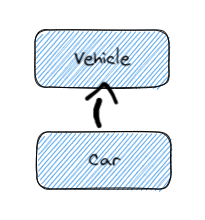
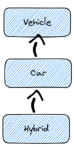
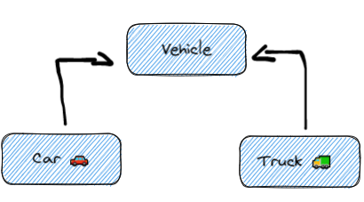
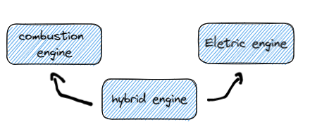

Inheritance is a way to create a new class from an existing class

We have two terminologies in inheritance:

- **Parent Class** -> this class allows the reuse of its public properties in another class
- **Child Class** -> this class inherits or extends the superclass(Parent Class)

pratical example:

```py
class ParentClass:
    # attributes of the parent class


class ChildClass(ParentClass):
    # attributes of the child class

```

##### the child class inherits all the properties and methods of the Parent class an can acess and modify them.

another example:

```py
class Vehicle:
    def __init__(self, make, color, model):
        self.make = make
        self.color = color
        self.model = model

    def printDetails(self):
        print("Manufacturer:", self.make)
        print("Color:", self.color)
        print("Model:", self.model)


class Car(Vehicle):
    def __init__(self, make, color, model, doors):
        # calling the constructor from parent class
        Vehicle.__init__(self, make, color, model)
        self.doors = doors

    def printCarDetails(self):
        self.printDetails()
        print("Doors:", self.doors)


obj1 = Car("Suzuki", "Grey", "2015", 4)
obj1.printCarDetails()
```

## The super function

the `super()` function is a special function that is used to refer to the parent class of a subclass. It is typically used in the `__init__` method of a subclass(child class)
for example:

```py
class Animal:
    def __init__(self, name, species):
        self.name = name
        self.species =species

class Cat(Animal):
    def __init__(self, name, breed, toy):
        super().__init__(name, species="Cat")
        self.breed = breed
        self.toy = toy


```

another example:

```py
class Vehicle:  # defining the parent class
    fuelCap = 90

class Car(Vehicle):  # defining the child class
    fuelCap = 50

    def display(self):
        carrin = 80
        if(carrin > super().fuelCap):
            return super().fuelCap
        else:
            return self.fuelCap

obj = Car()
print(obj.display())
# super() refers the parent

```

### The super() is also used with initializers

```py
class ParentClass():
    def __init__(self, a, b):
        self.a = a
        self.b = b


class ChildClass(ParentClass):
    def __init__(self, a, b, c):
        super().__init__(a, b)
        self.c = c


obj = ChildClass(1, 2, 3)
print(obj.a)
print(obj.b)
print(obj.c)
```

## Types of Inheritance

- Single
- Multi-level
- Hierarchical
- Multiple
- Hybrid

### Single nheritance

Single Inheritance is the basic relation, when there is only a single class extending from another class



### Multi-level Inheritance

When a class is derived from a class which itself is derived from another class


### Hierarchical inheritance

When more than one class extends from the same class parent


```py
class Vehicle:  # parent class
    def setTopSpeed(self, speed):  # defining the set
        self.topSpeed = speed
        print("Top speed is set to", self.topSpeed)


class Car(Vehicle):  # child class of Vehicle
    pass


class Truck(Vehicle):  # child class of Vehicle
    pass


corolla = Car()  # creating an object of the Car class
corolla.setTopSpeed(220)  # accessing methods from the parent class

volvo = Truck()  # creating an object of the Truck class
volvo.setTopSpeed(180)  # accessing methods from the parent class
```

### Multiple inheritance

When a class is derived from more than one base class, when a class has more than on immediate parent class



```py
class CombustionEngine():
    def setTankCapacity(self, tankCapacity):
        self.tankCapacity = tankCapacity


class ElectricEngine():
    def setChargeCapacity(self, chargeCapacity):
        self.chargeCapacity = chargeCapacity

# Child class inherited from CombustionEngine and ElectricEngine
class HybridEngine(CombustionEngine, ElectricEngine):
    def printDetails(self):
        print("Tank Capacity:", self.tankCapacity)
        print("Charge Capacity:", self.chargeCapacity)

car = HybridEngine()
car.setChargeCapacity("250 W")
car.setTankCapacity("20 Litres")
car.printDetails()

###
```
### Hybrid inheritance
Is a combination of Multiple and Multi-level

* CombustionEngine IS A Engine.
* ElectricEngine IS A Engine.
* HybridEngine IS A ElectricEngine and a CombustionEngine.