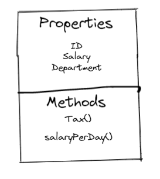

Suppose, there are two employees in our fictional company

- 🧑 -> Mark
- 👩 -> Maria

#### Mark properties:

- **ID**: 562
- **Salary**: 3000
- **Department**: Educational

#### Maria properties:

- **ID**: 561
- **Salary**: 5000
- **Department**: Software

#### employee class



### Properties

properties(or attributes) are variables that contain information about the object of a class. `ID`, `Salary`, `department` are properties of employee object

### Methods

Methods are like functions that have access to properties of a class. They can accept parameters and return values.

## class in Python

```py

class myClass:
    pass
obj = MyClass()
print(obj)
```

lets create our employee class

```py
class Employee:
    ID = 562
    salary =  3000
    department = "Educational"

Mark = Employee()
print("ID =", Mark.ID)
print("Salary", Mark.salary)
print("Department:", Mark.department)
```

another example:

```py
class Employee:
    # defining the properties and assigning them None
    ID = None
    salary = None
    department = None


# cerating an object of the Employee class
Maria = Employee()

# assigning values to properties of Maria - an object of the Employee class
Maria.ID = 561
Maria.salary = 500
Maria.department = "Software"
Maria.title = "Tech Lead" # it is even possible add a new propertie outside the class

# Printing properties of Maria
print("ID =", Maria.ID)
print("Salary", Maria.salary)
print("Department:", Maria.department)
print("Tittle:", Maria.title)
```

### Initializer

initializer is used to initialize objects of classes
ps: it is a good pratice to define the initializers as the first member method in the class definition

example:

```py
class Employee:
    def __init__(self, ID, salary, department):
        self.ID = ID
        self.salary = salary
        self.department = department

# creating an object of the Employee class with default parameters
Steve = Employee(356, 2500, "Human Resources")

print("ID :", Steve.ID)
print("Salary :", Steve.salary)
print("Department :", Steve.department )
```

### Class and Instance Variable

In python, properties can be defined into two parts:

- Class variables
- Instance variables

```py
class Player:
    teamName = 'Liverpool'  # class variables

    def __init__(self, name):
        self.name = name  # creating instance variables


p1 = Player('Mark')
p2 = Player('Steve')

print("Name:", p1.name)
print("Team Name:", p1.teamName)
print("Name:", p2.name)
print("Team Name:", p2.teamName)
```
**references**:
* Classes and Instances in Python -> https://www.youtube.com/watch?v=hVtRA__K1Ik