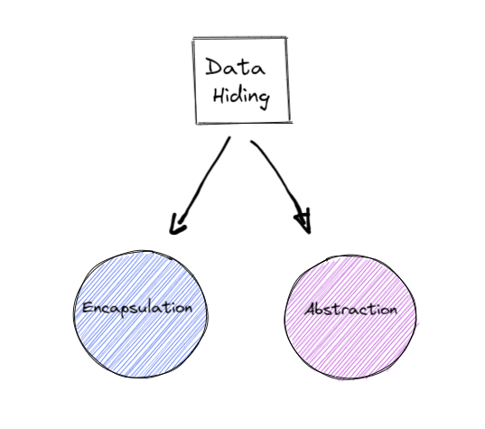

## Information hiding 

Information hiding refers to the concept of hiding the inner workings of a class
providing an interface through which the outside world can interact with the class without knowing what is going on inside ⚙

#### Data hiding can be divided into two primary components:

* Encapsulation
* Abstraction

