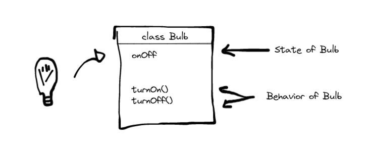

### Procedural programming

In procedural programming, a program is divided into smaller parts who is called `methods` they are the basics to construct a program. However, when we need complex real-world scenario, it is a difficult task.

### OOP - Object-oriented programming

Is a programming paradigm that relies, on the concept of classes and objects.

The basic idea of OOP is to divide a sophisticated program into a number of objects that talk to each other

An object program has the mission of represent real-world objects

* 🚲 -> A bicycle object
* 🧑 -> A person object
* 💡 -> A bulb object

Objects are a collection of data and their behaviors
A class is a blueprint for creating objects

lets imagine the Bulb class:

### User-defined data types

classes are user-defined ata types which is implemented using primitive data types, `boolean`, `ìnt`, `char`. 
Primitive data types focus on modeling the state of the objects, while user defined types can encapsulate the state and its behaviors into a unit

#### user-defined
* onOff()
* turnOn()
* turnOff()

#### primitive data type
* true
* false