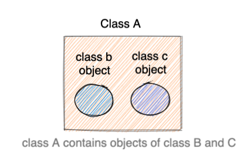

## Relationships between classes

there are three main class relationships:
* IS A
* Part-of
* Has-a

### part-of

In this relationship, one class object is a __component__ of another class object.

## aggregation

Aggregation follows the hAS-a model. It creates a parent-child relationship, one class owining the object of another 

* `In aggregation, the lifetime of the owned object does not depend on the  lifetime of the owner`

## Composition

* `in composition, the lifetime of the owned object depends on the lifetime of the owner`