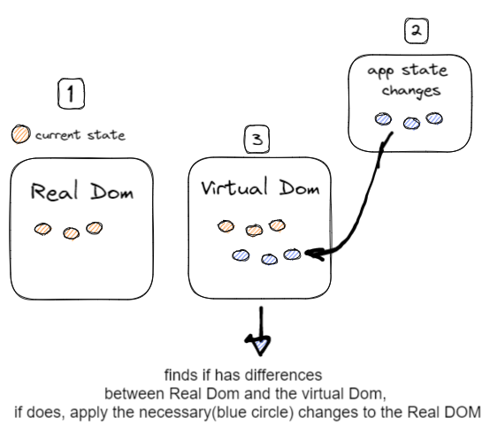

Virtual DOM Is the hierarchy tree, this tree is used by React to refresh only the parts of the tree that have actually changed

## Reconciliation algorithm

React will figure out which parts of an application have changed and will only update the parts that have actually been update.

reconciliation compares the previus state with the current state,React processes what has changed and can reduce the number of writes to a minimum.

If used correctly, React's **reconciliation process** can drastically improve the performance of our application because regular DOM updates are very costly
