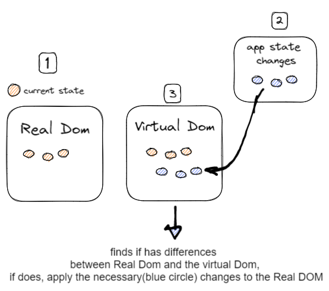

Virtual DOM Is the hierarchy tree, this tree is used by React to refresh only the parts of the tree that have actually changed

## Reconciliation algorithm

reconciliation compares the previus state with the current state,React processes what has changed and can reduce the number of writes to a minimum